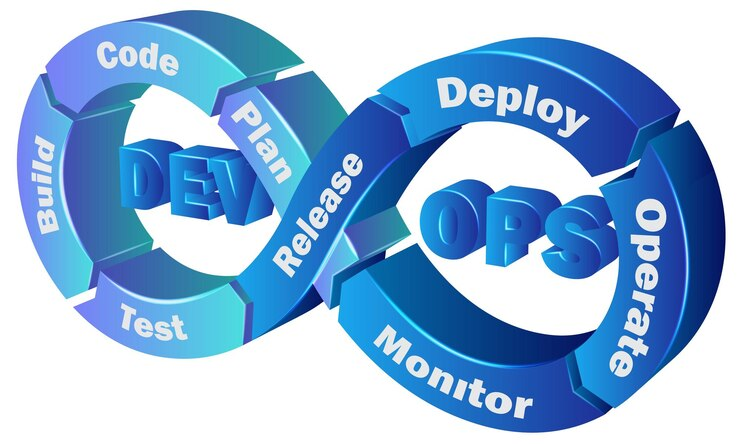

# DevOps Fundamentals By Daslaw

## Foundational DevOps Concepts

**DevOps** is a set of practices that combines software development (Dev) and IT operations (Ops) to shorten the system development lifecycle and provide continuous delivery with high software quality. It fosters collaboration between development and operations teams, emphasizing automation, integration, and continuous improvement.

### Core Principles:
- **Collaboration:** Breaks down silos between development and operations teams.
- **Automation:** Automates repetitive tasks to improve efficiency and reduce errors.
- **Continuous Integration/Continuous Delivery (CI/CD):** Ensures code changes are automatically tested and deployed.
- **Monitoring and Feedback:** Tracks performance and user feedback to guide improvements.
- **Infrastructure as Code (IaC):** Manages infrastructure through code for consistency and scalability.

## DevOps Lifecycle Stages

- **Planning:** Define project scope, goals, and delivery timelines through collaboration and requirement gathering.
- **Development:** Write code in small, iterative changes, often using version control and agile methodologies.
- **Building:** Compile and package the application code using automation tools, ensuring it’s ready for deployment.
- **Testing:** Run automated and manual tests to validate functionality, security, and performance.
- **Release:** Prepare the final version of the software for production, ensuring all components are stable and approved.
- **Deployment:** Automatically deploy applications to production environments with minimal downtime.
- **Operations:** Manage infrastructure and application availability, ensuring stable performance in live environments.
- **Monitoring:** Continuously observe systems, gather logs and metrics, and provide feedback for incident response and future improvements.

If you have any questions, do not hesitate to reach out.

Thanks for reading!
